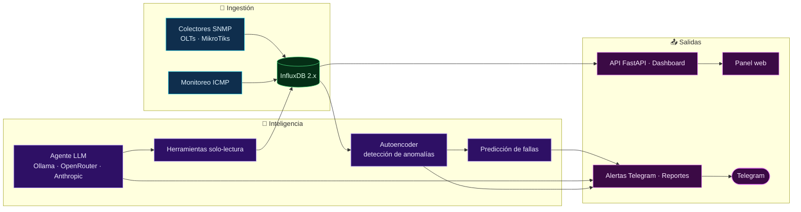

<div align="center">

<picture>
  <source media="(prefers-color-scheme: dark)" srcset="assets/hero-dark.svg">
  
</picture>

<!-- ======================= BADGES : STACK ======================= -->
| | |
|:---|---:|
|  |  |  |

|  |  |  |

|  |  |  |

|  |  |  |

|  |  |

</div>

---

Sistema de **monitoreo autónomo** para proveedores de Internet **FTTH/GPON**. Recopila datos de OLTs y MikroTiks vía **SNMP**, detecta **anomalías ópticas** con un **autoencoder** entrenado en PyTorch, correlaciona fallas con los clientes afectados y genera **análisis y alertas automáticas** con un **agente LLM** (Ollama / OpenRouter / Anthropic). Todo se presenta en un **dashboard web** (FastAPI + InfluxDB) y se notifica por **Telegram**.

> **🔒 Nota de seguridad:** los secretos (tokens, passwords, communities SNMP, topología real) **no** se incluyen en el repositorio: se cargan desde `.env` / `.env.ia` y archivos de configuración ignorados por `.gitignore`. Ver [Seguridad](#-seguridad).

---

## ✨ Características

| 🛰️ Colectores SNMP | 🧠 Anomalías con IA | 📡 Monitoreo ICMP |
|:---:|:---:|:---:|
| Potencia óptica ONU (RX/TX dBm), puertos GE/PON, CPU/RAM/temp de OLTs y MikroTiks, tráfico de interfaces, errores, discards, PPPoE. | Detección de degradación óptica con **autoencoder** (umbral configurable y reentrenamiento diario). | Disponibilidad y latencia de equipos y DNS con alertas por caída y por recuperación. |

| 🔮 Predicción de fallas | 🤖 Agente LLM | 🧾 Correlación con clientes |
|:---:|:---:|:---:|
| Predice fallas a futuro según tendencias de degradación de potencia (horas estimadas). | Inspecciona la red con herramientas de solo lectura (`get_network_summary`, `lookup_client`, `clients_on_pon`…), correlaciona **OLT→PON→NAP→clientes** e informa. | Agrupa clientes afectados por **zona** y por **casilla PON** desde el CSV de suscripciones. |

| ⚡ Notificaciones Telegram | 📊 Dashboard en vivo | 🖥️ Operación simple |
|:---:|:---:|:---:|
| Alertas con cooldown, reportes programados con gráficos, resúmenes e incidencias **LOS / DyingGap**. | API REST FastAPI + panel web (MikroTiks, OLTs por puerto PON/ONU, anomalías, agentes, reportes). | Servicios **systemd** de usuario, `Docker Compose` para InfluxDB y `Dockerfiles` por componente. |

---

## 🏗️ Arquitectura



Los componentes corren como **servicios systemd de usuario**; InfluxDB puede ejecutarse en Docker (`compose.yml`).

---

## 📁 Estructura del proyecto

<details>
<summary>Ver árbol de directorios</summary>

```
agente-monitor/
├── src/
│   ├── main.py                  # Agente base (eventos, legacy Zabbix)
│   ├── config.py / config_ia.py # Configuración + variables de entorno
│   ├── collectors/              # Colectores SNMP (OLT/MikroTik) + escaneo ONU
│   ├── ai/                      # Motor IA: autoencoder, detección, agente LLM
│   │   └── llm_agent/           # Agente LLM (herramientas de solo lectura)
│   ├── api/                     # API FastAPI + dashboard (static/ y templates/)
│   ├── reporte/                 # Generación de reportes y gráficos
│   ├── storage/                 # Cliente InfluxDB
│   ├── notifier*.py             # Notificaciones Telegram
│   ├── grouper.py               # Agrupación de clientes por zona (ML)
│   └── client_lookup.py         # Lookup ONU → cliente
├── config/
│   ├── config.yaml              # Config base del agente
│   ├── config_ia.yaml           # Config IA/colectores/LLM/API
│   ├── nodes.yaml.example       # Plantilla de nodos (OLTs/MikroTiks)
│   ├── ping_targets.yaml.example# Plantilla de blancos ICMP
│   ├── instructions.json        # Instrucciones del agente IA
│   ├── llm_config.json          # Config runtime del agente LLM
│   └── telegram-report-format.conf
├── tests/                       # Suite de pruebas (pytest)
├── assets/                      # Banner y recursos del README
├── scripts/start-all.sh         # Arranque de todos los componentes
├── mantenimiento.sh             # Atajos systemctl --user
├── compose.yml                  # InfluxDB en Docker
├── Dockerfile*                  # Imágenes por componente
├── requirements.txt             # Dependencias base
└── requirements-ia.txt          # Dependencias IA/API/test
```

</details>

---

## 🪄 Requisitos

- **Python 3.11+**
- **InfluxDB 2.x** (recomendado vía `compose.yml`)
- Acceso **SNMP** a OLTs y MikroTiks; **ICMP** a los blancos de ping
- **Telegram Bot** para notificaciones *(opcional si se deshabilitan)*
- **Ollama** o API OpenRouter/Anthropic *(solo si se usa el agente LLM)*

---

## 🚀 Puesta en marcha

### 1 · Clonar y preparar el entorno

```bash
git clone https://github.com/aemsyncgd/agente-monitor.git
cd agente-monitor

python3 -m venv venv
source venv/bin/activate
pip install -r requirements.txt -r requirements-ia.txt
```

### 2 · Configurar secretos

Los secretos nunca se editan en el código. Copia las plantillas y completa los valores:

```bash
cp .env.example .env                          # secretos base (INFLUXDB_ADMIN_TOKEN)
cp .env.ia.example .env.ia                    # secretos del sistema IA
cp config/nodes.yaml.example config/nodes.yaml          # topología real
cp config/ping_targets.yaml.example config/ping_targets.yaml
```

> **⚠️ Importante:** `config/nodes.yaml` y `config/ping_targets.yaml` contienen IPs
> internas y **communities SNMP** — están **excluidos de git** para evitar su publicación.

| Variable | Descripción |
| --- | --- |
| `TELEGRAM_BOT_TOKEN` | Token del bot de Telegram para alertas/reportes |
| `TELEGRAM_CHAT_ID` | Chat o grupo donde se envían las notificaciones |
| `INFLUXDB_URL` / `INFLUXDB_TOKEN` | Endpoint y token de InfluxDB |
| `INFLUXDB_ORG` / `INFLUXDB_BUCKET` | Organización y bucket de InfluxDB |
| `INFLUXDB_ADMIN_TOKEN` | Token admin inicial (usado por `compose.yml`) |
| `SNMP_COMMUNITY` | Community string SNMP de los equipos |
| `SSH_USERNAME` / `SSH_PASSWORD` | Credenciales SSH para verificación de fallas |
| `API_KEY` | API key **admin** de la API (obligatoria) |
| `API_KEY_VIEWER` / `API_KEY_OPERATOR` | API keys de solo lectura / operador (opcional) |
| `ALLOWED_ORIGINS` | Orígenes CORS permitidos (vacíos = *same-origin*) |
| `ENABLE_HSTS` | HSTS solo si se sirve HTTPS con certificado válido |
| `OPENROUTER_API_KEY` | API key si el LLM usa OpenRouter |
| `CONFIG_PATH` | Ruta del archivo de configuración |

Genera claves seguras con:

```bash
python -c "import secrets; print(secrets.token_urlsafe(32))"
```

### 3 · Iniciar InfluxDB

```bash
docker compose up -d
# o bien:  systemctl --user start influxdb-ia.service
```

### 4 · Ejecutar el agente

Un comando lanza collector + API + IA + LLM (espera a que InfluxDB esté healthy):

```bash
./scripts/start-all.sh
```

Con systemd puedes usar los atajos:

```bash
./mantenimiento.sh --ready    # iniciar todo y esperar a que esté operativo
./mantenimiento.sh --status   # estado de los servicios
./mantenimiento.sh --now      # detener todo
```

Componentes individuales:

| Componente | Comando |
| --- | --- |
| Colectores SNMP | `python -m src.collectors.main` |
| Dashboard / API | `uvicorn src.api.main:app --host 0.0.0.0 --port 8000` |
| Motor IA | `python -m src.ai.main` |
| Agente LLM | `python -m src.ai.llm_agent.main` |

El dashboard queda en `http://<host>:8000/` (protegido con API key vía `X-API-Key`).

### 5 · Containers (opcional)

```bash
docker build -f Dockerfile.ai -t agente-monitor-ai .
docker build -f Dockerfile.collector -t agente-monitor-collector .
docker build -f Dockerfile.api -t agente-monitor-api .
```

---

## 🧪 Pruebas

```bash
source venv/bin/activate
pytest
```

Suite actual: **80 tests** · `pytest` + `pytest-asyncio`.

---

## 🔒 Seguridad

- Los secretos **nunca se versionan**: `.env`, `.env.ia`, `backups/`, `logs/`, `apis.md` (tokens), `config/nodes.yaml` y `config/ping_targets.yaml` (topología + communities SNMP), `influxdb/` y `grid_servicios.csv` (datos de clientes) están en `.gitignore`.
- La API usa autenticación por API key con roles (`admin` / `operator` / `viewer`) y CORS restringido.
- Si un secreto se filtra alguna vez, **rótalo inmediatamente** (asume que está comprometido).

---

## ⚖️ Licencia

Proyecto publicado bajo la **GNU General Public License v3.0** — ver [LICENSE](LICENSE).